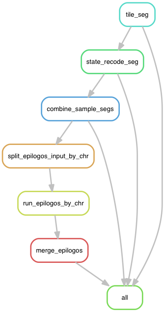

## Snakemake workflow for epilogos on chromHMM data

[chromHMM](http://compbio.mit.edu/ChromHMM/) is software for learning and characterizing chromatin states based on a multivariate Hidden Markov Model. ChromHMM can integrate multiple chromatin datasets such as ChIP-seq data of various histone modifications to discover de novo the major re-occuring combinatorial and spatial patterns of marks.

[epilogos](https://github.com/Altius/epilogos) is developed to summarise multiple chromHMM profiles across samples.
From here https://epilogos.altiusinstitute.org/ , you can visualize pre-computed epilogos for
various ENCODE/epigenomeRoadmap tissue and cell lines.

epilogos can only run in a  per-chromosome manner. That's why I wrote this snakemake workflow to
simplify this process.

When you copy and paste the same code three times, it is time to write a function. Similarily, if
you need to do the same task for more than 3 times, write a workflow :)

### Dependencies

1. `R/3.4.1` and above.
bioconductor packages: `GenomicRanges`, `rtracklayer`.
R packages:  `tidyverse`, `purrr`, `stringr`.

2. `python3.x`.

3. `epilogos`.

`computeEpilogos_singleChromosomeSingleProcessor.sh` needs to be on your `PATH`.


### steps

workflow:



#### submit jobs in `LSF` system.

Now, the `bsub_cluster.py` is written specifically for `LSF` system. if you have
access to a `LSF` cluster, you can do:

```bash
# log in to remote cluster
ssh railab

# start a screen session
screen

# create a py3 environment
conda create -n py351 python=3.5 snakemake

# activate the environment
source activate py351
# some R packages only for this R version
module load R/3.4.1-shlib

git clone https://github.com/crazyhottommy/pyflow-epilogos

cd pyflow-epilogos

python3 samples2json.py --segment_dir /full/path/to/a/folder/containing/segments
# some info will be printed out and you can check the samples.json file.

# change some settings
nano config.ymal

# dry run
snakemake -np

# submit to cluster
./pyflow-epilogos

```

#### run locally
Computation is not intensive for epilogos, The whole process can finish within 1 hour for 40 samples (depending on
how many CPUs and samples you have though).

```bash
snakemake -j4
```


### technical details.

chromHMM outputs various files. Two that you may want to know: `segments.bed` and `dense.bed` files.
For `segments.bed` file, there is no header and the 4th state column has a prefix E. e.g. E1, E2...E15;
for `dense.bed` file, there is a header and the 4th state column is just a number. e.g. 1,2...15. The 9th column is RGB color.
This file is used for loading to `IGV` for visualization.

To run `epilogos`, we need the `segments.bed` files. However, `chromHMM` merges the consecutive bins together if they are of the
same state. We need to tile the `segments.bed` file back to bin size.  check `tile_seg.R` in the scripts folder.

**About state recoding**:

`chromHMM` needs user to specify the number of state model. (e.g. 15, 18, or any number). Many times, if one checks the
`emission_18.png` chromHMM output emission file, there are some redundant states. For example, multiple states are all low, but was assigned a different state number for each one of them. Those states can be combined. see below for a script to deal with it.


### Utilities

Inside the `scripts` folder, there are helper scripts for various tasks.

1. `recode_dense_seg_state_color.py`

This script can recode the state according to a map file for either `dense.bed` or `segments.bed` file.

```bash
python recode_dense_seg_state_color.py --file_type [dense, seg] --infile segment_dense.bed --state_color_map my_map.txt  --ofile segment_new_color.bed`
```

The my_map.txt file looks like (header required):

```
old_state	new_state	new_color
1	1	0,0,255
10	10	204,153,255
11	11	204,204,102
12	12	255,255,0
13	13	255,255,204
14	4	102,51,153
15	8	102,153,51
2	2	0,153,204
3	3	0,255,255
4	3	0,255,255
5	5	0,204,51
6	6	0,102,0
7	7	0,0,51
8	3	0,255,255
9	9	255,0,204
```
The easiest way to create this file:

```bash
cat dense.bed | sed '1d' | cut -f4,9 | sort | uniq > my_map.txt
```

then edit by hand.

In this example, state 3,4,8 changed to 3 (because they are all low state in my case).
new_color should be the same for the same new_state. Be aware that, after combining states, the
total number of states will be less than what you specifiy when you run `chromHMM`. In this example,
chromHMM was run in 15 state model. After combining low states, it now only has 13 states. `epilogos`
requires the recoded states in a consecutive order (from 1 to 13), you can not have something like:
1,2,3,3,5,6,7,3,9,10,11,12,13,14,15 as your recoded states.

2. `merge_bin.py`

merge consecutive bins together if the states across samples
are the same. It does not matter how many samples (columns after chr, start, end)
you have.

`python merge_bin.py --infile input.txt --ofile output.txt`

```
chr1    0   200 E1  E2  E2  E3
chr1    200 400 E1  E2  E2  E3
chr1    400 600 E2  E2  E2  E3

will be merged to

chr1    0   400 E1  E2  E2  E3
chr1    400 600 E2  E2  E2  E3
```

This scripts assumes the coordinates are sorted and consecutive across the chromosome.
If the chromHMM calls are not tiled in to the bin size (200bp in the case). use
the `tile_seg.R`script to do it.

3. `choose_state.py`

choose state from a epilogos output. It does not matter how many states in the model.
This script will choose the state with the greates value.

`python choose_state.py --infile qcat.bed --ofile output.bed`

```
chr1	126474600	126474800	id:632374,qcat:[ [0,1], [0,2], [0,3], [0,4], [0,5], [0,6], [0,7], [0,8], [0,9], [0,10], [0,11], [0,12], [0,13], [0,14], [0.5832,15] ]
chr1	103536000	103536200	id:517681,qcat:[ [0,1], [0,2], [0,3], [0,4], [0,5], [0,6], [0,7], [0,8], [0,9], [0,10], [0,11], [0,12], [0,13], [0,14], [0.5832,15] ]
chr1	235431400	235431600	id:1177158,qcat:[ [-0.2303,15], [0,1], [0,2], [0,3], [0,4], [0,6], [0,8], [0,9], [0,10], [0,11], [0,12], [0,13], [0,14], [0.9458,7], [1.688,5] ]
chr1	130883200	130883400	id:654417,qcat:[ [0,1], [0,2], [0,3], [0,4], [0,5], [0,6], [0,7], [0,8], [0,9], [0,10], [0,11], [0,12], [0,13], [0,14], [0.5832,15] ]
chr1	168036200	168036400	id:840182,qcat:[ [0,1], [0,2], [0,3], [0,6], [0,7], [0,8], [0,9], [0,10], [0,11], [0,12], [0,13], [0,14], [0,15], [0.8748,5], [2.135,4] ]
chr1	134171800	134172000	id:670860,qcat:[ [0,1], [0,2], [0,3], [0,4], [0,5], [0,6], [0,7], [0,8], [0,9], [0,10], [0,11], [0,12], [0,13], [0,14], [0.5832,15] ]
chr1	32956200	32956400	id:164782,qcat:[ [-0.3222,15], [0,1], [0,2], [0,3], [0,4], [0,5], [0,6], [0,7], [0,8], [0,9], [0,10], [0,11], [0,12], [0,13], [1.595,14] ]
chr1	36426200	36426400	id:182132,qcat:[ [-0.3513,15], [0,1], [0,2], [0,3], [0,4], [0,6], [0,7], [0,8], [0,9], [0,10], [0,11], [0,12], [0,13], [0,14], [2.291,5] ]
chr1	237380600	237380800	id:1186904,qcat:[ [0,1], [0,2], [0,3], [0,4], [0,5], [0,6], [0,7], [0,8], [0,9], [0,10], [0,11], [0,12], [0,13], [0.04442,14], [0.3093,15] ]
chr1	71615400	71615600	id:358078,qcat:[ [0,1], [0,2], [0,3], [0,4], [0,5], [0,6], [0,7], [0,8], [0,9], [0,10], [0,11], [0,12], [0,13], [0,14], [0.5832,15] ]
```
will change to

```
chr1	126474600	126474800	E15
chr1	103536000	103536200	E15
chr1	235431400	235431600	E5
chr1	130883200	130883400	E15
chr1	168036200	168036400	E4
chr1	134171800	134172000	E15
chr1	32956200	32956400	E14
chr1	36426200	36426400	E5
chr1	237380600	237380800	E15
chr1	71615400	71615600	E15
```
